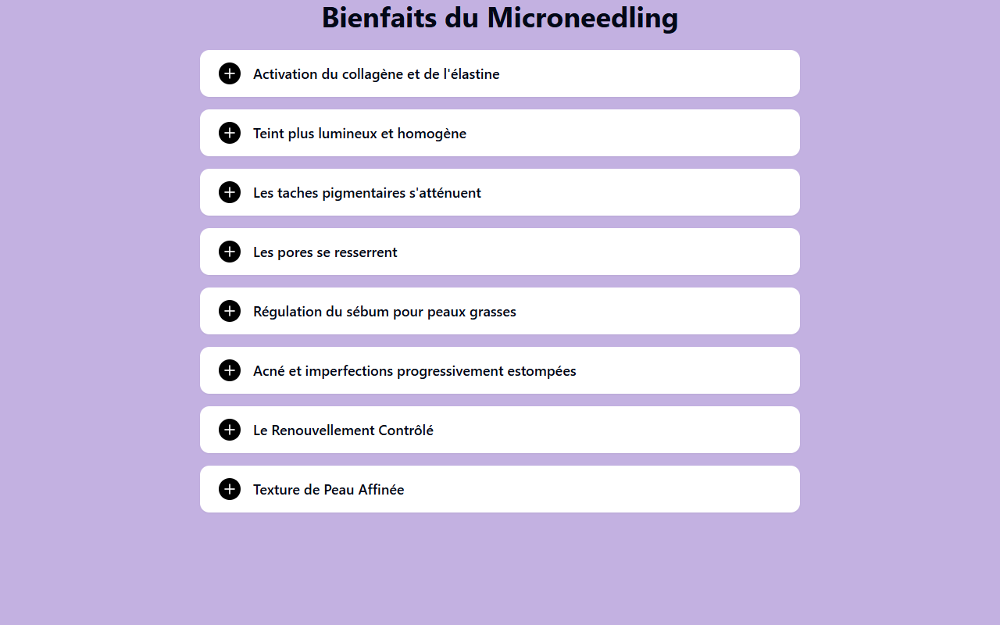

# Technique de Microneedling

**Course:** LE MICRONEEDLING  
**Slide:** 4  
**Live URL:** https://ahds.edtechiecorp.com  
**Stack:** Next.js · Tailwind CSS · TypeScript · GitHub Pages  

## What this slide does

Explains the core microneedling application technique, covering needle depth settings, skin preparation, and movement patterns across different facial zones. The slide uses visual diagrams to show practitioners how to adjust pressure and speed depending on skin thickness and treatment area. Learners are expected to understand this technique content before moving on to client protocols.

## Screenshot

## Usage

This slide is embedded as an iframe inside Coassemble at the live URL above. DNS is managed via Cloudflare (`edtechiecorp.com`). To update the slide, push to the `main` branch — GitHub Actions will rebuild and redeploy automatically.
